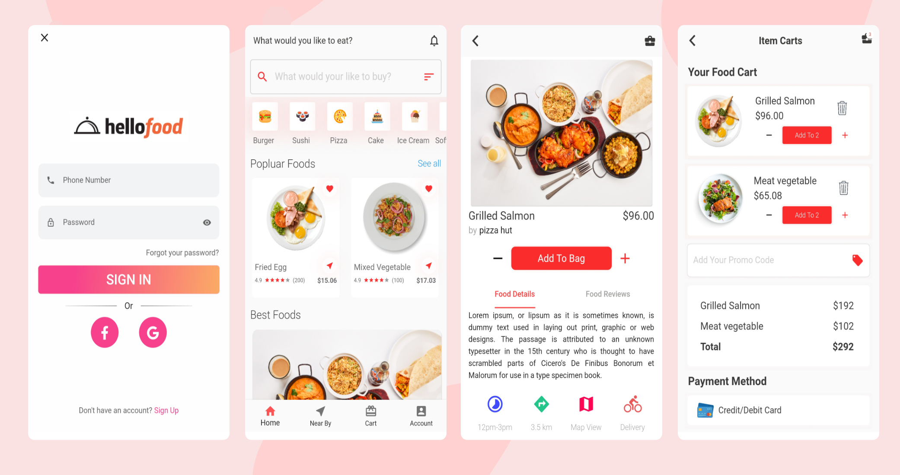
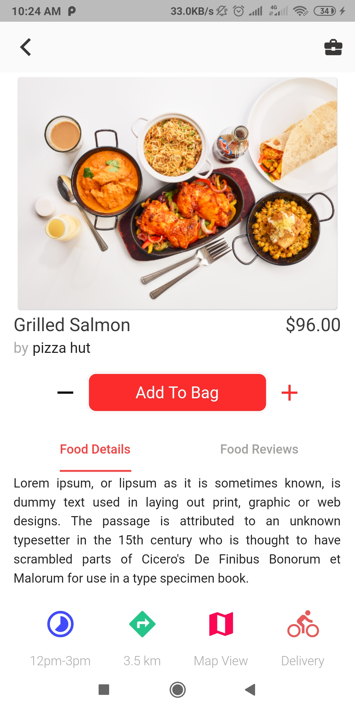

# Flutter Food Delivery Application Design

A small attempt to make an Food delivery app user interface in Flutter for Android and iOS.

## FOOD BUY&&DELIVERY APP

## ScreenShots
### Home Page

### Food Details Screen & Add To Cart Screen
 &nbsp;&nbsp;&nbsp;&nbsp; 

### Login & Registration Screen
&nbsp;&nbsp;&nbsp;&nbsp; 

## ✨ Requirements
* Any Operating System (ie. MacOS X, Linux, Windows)
* Any IDE with Flutter SDK installed (ie.  Android Studio, VSCode, IntelliJ, etc)
* A  knowledge of Dart and Flutter
# FOLLOW ME ON😎:-

# CONTACT ME📱:-
#### G-MAIL:- reejalree@gmail.com
#### MOBILE:- +917018361108

<h3 align="left">Support🙏:</h3>

  

