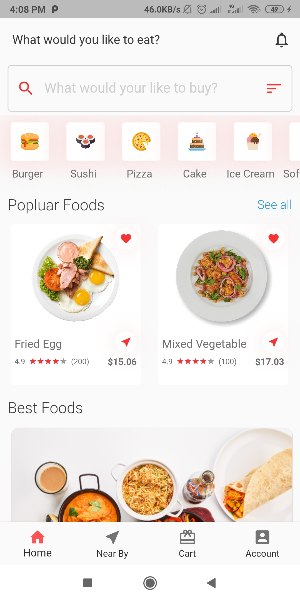
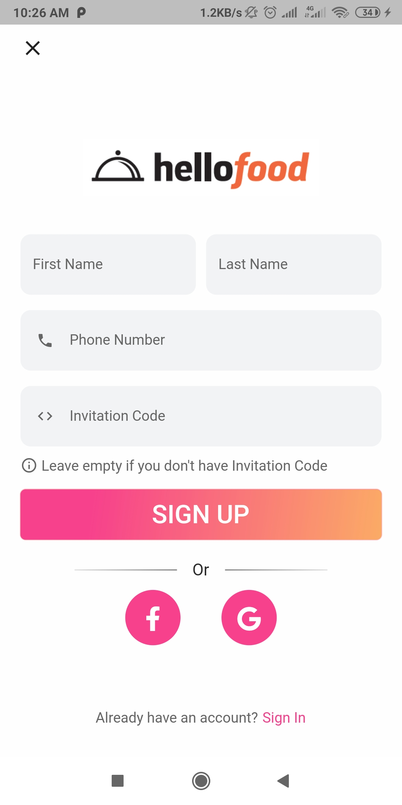

# Flutter Food Delivery Application Design

## This application is not completed yet. Currently, I am working on it. 
A small attempt to make an Food delivery app user interface in Flutter for Android and iOS.

## 😎 Author(s)
**reejal choudhary** **twitter=https://twitter.com/ChoudharyReejal**
## FOOD BUY&&DELIVERY APP

## ScreenShots
### Home Page

### Food Details Screen & Add To Cart Screen
 &nbsp;&nbsp;&nbsp;&nbsp; 

### Login & Registration Screen
&nbsp;&nbsp;&nbsp;&nbsp; 

## ✨ Requirements
* Any Operating System (ie. MacOS X, Linux, Windows)
* Any IDE with Flutter SDK installed (ie.  Android Studio, VSCode, IntelliJ, etc)
* A  knowledge of Dart and Flutter
# FOLLOW ME ON😎:-
#### INSTAGRAM:- www.instagram.com/rexjll/
#### TWITTER:- https://twitter.com/ChoudharyReejal
#### LINKEDIN:- www.linkedin.com/in/reejal-choudhary-532386237
# CONTACT ME📱:-
#### G-MAIL:- reejalree@gmail.com
#### BUSINESS MAIL:- letstalk@reejalhere.unaux.com
#### MOBILE:- +917018361108

<h3 align="left">Support:</h3>

  

